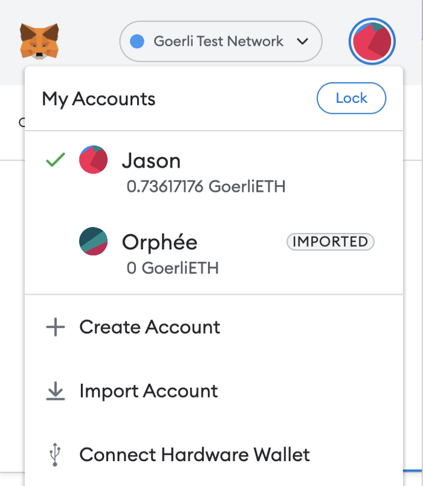
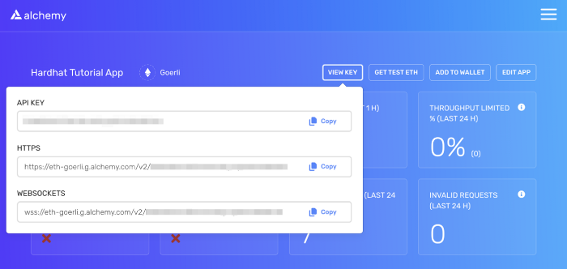
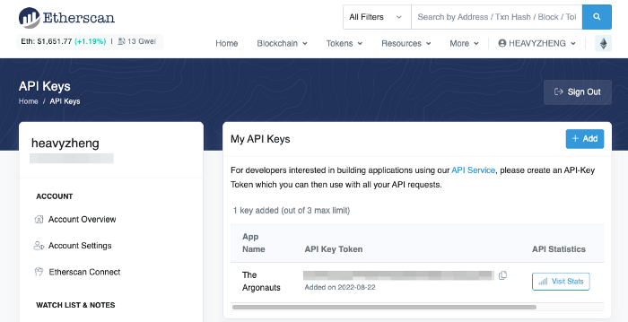

# The PetShop project: First day on Ethereum

I'm planning to build a simple web3 pet shop application from scratch. Every day I'll try to enhance the application and write down some notes. By doing so, hopefully I could teach myself about Ethereum, Solidity, Hardhat, and web3 development.

The project is hosted on GitHub: https://github.com/zhengzhong/petshop

## The first day objectives

- Set up a Hardhat project
- Create and compile a simple token in Solidity
- Create and run some tests for this contract
- Deploy the contract to the local Hardhat network
- Deploy the contract to the Goerli testnet

## Set up a Hardhat project

I was basically following the [Hardhat's tutorial for beginners](https://hardhat.org/tutorial). I was using node v16.9.1 and npm 8.7.0. Everything went on smoothly. So I'm summarizing the steps below without detailed explanation.

Firstly, create an npm project, install some dependencies, and create an empty `hardhat.config.js` file:

```console
$ npm init
...

$ npm install --save-dev \
    hardhat \
    @nomicfoundation/hardhat-toolbox \
    @nomiclabs/hardhat-ethers \
    ethers \
    dotenv
...

$ npx hardhat
888    888                      888 888               888
888    888                      888 888               888
888    888                      888 888               888
8888888888  8888b.  888d888 .d88888 88888b.   8888b.  888888
888    888     "88b 888P"  d88" 888 888 "88b     "88b 888
888    888 .d888888 888    888  888 888  888 .d888888 888
888    888 888  888 888    Y88b 888 888  888 888  888 Y88b.
888    888 "Y888888 888     "Y88888 888  888 "Y888888  "Y888
👷 Welcome to Hardhat v2.9.9 👷‍
? What do you want to do? …
  Create a JavaScript project
  Create a TypeScript project
❯ Create an empty hardhat.config.js
  Quit
```

## Create a simple token

Following the Hardhat convention, I'll use the following directories:

- `contracts/` to hold all smart contracts (in Solidity)
- `test/` to hold all unit tests
- `scripts/` to hold automation scripts
- `tasks/` to hold extra Hardhat tasks

Create `contracts/SimpleToken.sol` that implements a simple (non-ERC20) token. The contract code is copied and slightly modified from Hardhat's tutorial.

```solidity
// SPDX-License-Identifier: UNLICENSED

// Solidity files have to start with this pragma.
// It will be used by the Solidity compiler to validate its version.
pragma solidity ^0.8.16;

import "hardhat/console.sol";

// This is the main building block for smart contracts.
contract SimpleToken {
    // Some string type variables to identify the token.
    string public name = "My Simple Token";
    string public symbol = "MST";

    // The fixed amount of tokens, stored in an unsigned integer type variable.
    uint256 public totalSupply = 1_000_000;

    // An address type variable is used to store ethereum accounts.
    address public owner;

    // A mapping is a key/value map. Here we store each account's balance.
    mapping(address => uint256) balances;

    // The Transfer event is emitted when someone transfers some token(s) to someone else.
    // The event helps off-chain applications understand what happens within the contract.
    event Transfer(address indexed _from, address indexed _to, uint256 _value);

    /**
     * Contract initialization.
     */
    constructor() {
        // The totalSupply is assigned to the transaction sender, which is the
        // account that is deploying the contract.
        balances[msg.sender] = totalSupply;
        owner = msg.sender;
    }

    /**
     * A function to transfer tokens.
     *
     * The `external` modifier makes a function *only* callable from *outside*
     * the contract.
     */
    function transfer(address to, uint256 amount) external {
        // Check if the transaction sender has enough tokens.
        require(balances[msg.sender] >= amount, "Not enough tokens");
        if (msg.sender != to) {
            console.log("Transferring %s tokens: %s => %s", amount, msg.sender, to);
            balances[msg.sender] -= amount;
            balances[to] += amount;
            // Notify off-chain applications of the transfer.
            emit Transfer(msg.sender, to, amount);
        }
    }

    /**
     * Read only function to retrieve the token balance of a given account.
     *
     * The `view` modifier indicates that it doesn't modify the contract's
     * state, which allows us to call it without executing a transaction.
     */
    function balanceOf(address account) external view returns (uint256) {
        console.log("Querying balance of %s: %s", account, balances[account]);
        return balances[account];
    }
}
```

Compile the contract:

```console
$ npx hardhat compile
...
Compiled 2 Solidity files successfully
```

On a successful compilation, Hardhat will generate the artifact, including the contract ABI and its bytecode, in the `artifacts/` directory.

## Test the simple token

We use [ethers.js](https://docs.ethers.io/) to interact with the contract we built and deployed on Ethereum. We use [Mocha](https://mochajs.org/) as our test runner.

Before writing the test, update `hardhat.config.js` to import [hardhat-toolbox plugin](https://hardhat.org/hardhat-runner/plugins/nomicfoundation-hardhat-toolbox). This plugin bundles all the commonly used packages and Hardhat plugins, including ethers.js that we need in our test.

```js
require("@nomicfoundation/hardhat-toolbox");
```

Then, create `test/SimpleToken.js` (this file, again, is copied and slightly modified from Hardhat's tutorial):

```js
// This is an example test file. Hardhat will run every *.js file in `test/`,
// so feel free to add new ones.

// Hardhat tests are normally written with Mocha and Chai.

// Optional: `ethers` is injected in global scope automatically.
// TODO: Is this because of `require("@nomicfoundation/hardhat-toolbox")` in `hardhat.config.js`?
const { ethers } = require("hardhat");

// We import Chai to use its asserting functions here.
// See also: https://hardhat.org/hardhat-runner/plugins/nomicfoundation-hardhat-chai-matchers
const { expect } = require("chai");

// We use `loadFixture` to share common setups (or fixtures) between tests.
// Using this simplifies your tests and makes them run faster, by taking
// advantage of Hardhat Network's snapshot functionality.
const { loadFixture } = require("@nomicfoundation/hardhat-network-helpers");

// `describe` is a Mocha function that allows you to organize your tests.
// Having your tests organized makes debugging them easier. All Mocha
// functions are available in the global scope.
//
// `describe` receives the name of a section of your test suite, and a
// callback. The callback must define the tests of that section. This callback
// can't be an async function.
describe("SimpleToken contract", function () {

  // A fixture is a setup function that is run only the first time it's invoked.
  // On subsequent invocations, instead of re-running it, Hardhat will reset the state
  // of the network to what it was at the point after the fixture was initially executed.
  async function deploySimpleTokenFixture() {
    const SimpleToken = await ethers.getContractFactory("SimpleToken");
    const [owner, addr1, addr2] = await ethers.getSigners();

    // To deploy our contract, we just have to call Token.deploy() and await
    // its deployed() method, which happens onces its transaction has been mined.
    const simpleToken = await SimpleToken.deploy();
    await simpleToken.deployed();

    // Fixtures can return anything you consider useful for your tests.
    return { SimpleToken, simpleToken, owner, addr1, addr2 };
  }


  // You can nest describe calls to create subsections.
  describe("Deployment", function() {
    // `it` is another Mocha function. This is the one you use to define each
    // of your tests. It receives the test name, and a callback function.
    // If the callback function is async, Mocha will `await` it.
    it("should set the right owner", async function() {
      const { simpleToken, owner } = await loadFixture(deploySimpleTokenFixture);
      expect(await simpleToken.owner()).to.equal(owner.address);
    });

    it("should assign the total supply of tokens to the owner", async function () {
      const { simpleToken, owner } = await loadFixture(deploySimpleTokenFixture);
      const ownerBalance = await simpleToken.balanceOf(owner.address);
      expect(await simpleToken.totalSupply()).to.equal(ownerBalance);
    });

    it("should initialize the contract correctly", async function () {
      const { simpleToken } = await loadFixture(deploySimpleTokenFixture);
      expect(await simpleToken.name()).to.equal("My Simple Token");
      expect(await simpleToken.symbol()).to.equal("MST");
      expect(await simpleToken.totalSupply()).to.equal(1000000);
    });
  });


  describe("Transactions", function() {

    it("should transfer tokens between accounts", async function() {
      const { simpleToken, owner, addr1, addr2 } = await loadFixture(deploySimpleTokenFixture);
  
      expect(await simpleToken.balanceOf(addr1.address)).to.equal(0);
      expect(await simpleToken.balanceOf(addr2.address)).to.equal(0);
  
      // Transfer 50 tokens from owner to addr1.
      await expect(simpleToken.transfer(addr1.address, 50))
        .to.changeTokenBalances(simpleToken, [owner, addr1], [-50, 50]);
  
      // Transfer 50 tokens from addr1 to addr2.
      await expect(simpleToken.connect(addr1).transfer(addr2.address, 50))
        .to.changeTokenBalances(simpleToken, [addr1, addr2], [-50, +50]);
    });

    it("should emit Transfer events", async function () {
      const { simpleToken, owner, addr1, addr2 } = await loadFixture(deploySimpleTokenFixture);

      // Transfer 50 tokens from owner to addr1.
      await expect(simpleToken.transfer(addr1.address, 50))
        .to.emit(simpleToken, "Transfer").withArgs(owner.address, addr1.address, 50);

      // Transfer 50 tokens from addr1 to addr2.
      await expect(simpleToken.connect(addr1).transfer(addr2.address, 50))
        .to.emit(simpleToken, "Transfer").withArgs(addr1.address, addr2.address, 50);
    });

    it("should fail if sender doesn't have enough tokens", async function () {
      const { simpleToken, owner, addr1 } = await loadFixture(deploySimpleTokenFixture);
      const initialOwnerBalance = await simpleToken.balanceOf(owner.address);

      // Try to send 1 token from addr1 (0 tokens) to owner (1000 tokens).
      // `require` will evaluate false and revert the transaction.
      await expect(simpleToken.connect(addr1).transfer(owner.address, 1))
        .to.be.revertedWith("Not enough tokens");

      // Owner balance shouldn't have changed.
      expect(await simpleToken.balanceOf(owner.address)).to.equal(initialOwnerBalance);
    });

    it("should do nothing if transfer to self", async function () {
      const { simpleToken, owner } = await loadFixture(deploySimpleTokenFixture);
      await expect(simpleToken.transfer(owner.address, 1))
        .to.changeTokenBalances(simpleToken, [owner], [0]);
      await expect(simpleToken.transfer(owner.address, 1))
        .to.not.emit(simpleToken, "Transfer");
    });

  });

});
```

Run the test:

```console
$ npx hardhat test
  SimpleToken contract
    Deployment
      ✔ should set the right owner (1213ms)
      ✔ should assign the total supply of tokens to the owner (44ms)
      ✔ should initialize the contract correctly (42ms)
    Transactions
      ✔ should transfer tokens between accounts (196ms)
      ✔ should emit Transfer events (45ms)
      ✔ should fail if sender doesn't have enough tokens (60ms)
      ✔ should do nothing if transfer to self (58ms)
7 passing (2s)
```

## Deploy to the local Hardhat network

We are now going to deploy the simple token contract to the local Hardhat network.

Create a deploy script in `scripts/deploySimpleToken.js`:

```js
async function main() {
  // According to `hardhat.config.js` and the network we use,
  // this will give us an array of accounts.
  const [deployer] = await ethers.getSigners();
  console.log(`Deployer: ${deployer.address}`);
  console.log(`Deployer has a balance of: ${await deployer.getBalance()}`);

  const SimpleToken = await ethers.getContractFactory("SimpleToken");
  const simpleToken = await SimpleToken.deploy();
  await simpleToken.deployed();
  console.log(`Deployed SimpleToken at: ${simpleToken.address}`);
  console.log(`Deployer now has a balance of: ${await deployer.getBalance()}`);

  console.log(`Current block number: ${await ethers.provider.getBlockNumber()}`);
}

main()
  .then(() => process.exit(0))
  .catch((error) => {
    console.error(error);
    process.exit(1);
  });
```

Firstly, try to deploy the contract to the local Hardhat network. To do so, we invoke the script without providing a `--network` argument:

```console
$ npx hardhat run scripts/deploySimpleToken.js
...
Deployer: 0xf39Fd6e51aad88F6F4ce6aB8827279cffFb92266
Deployer has a balance of: 10000000000000000000000
Deployed SimpleToken at: 0x5FbDB2315678afecb367f032d93F642f64180aa3
Deployer now has a balance of: 9999998536390000000000
Current block number: 1
```

Now our first contract is deployed and we get the contract address. Try to write another script to interact with the contract.

```js
// Load the compiled contract artifact, following Hardhat's project layout.
const CONTRACT_ARTIFACT = require("../artifacts/contracts/SimpleToken.sol/SimpleToken.json");

// NOTE: We hard-code the address at which the contract is deployed.
// Depending on the network, make sure it has the correct value.
const CONTRACT_ADDRESS = "0x5FbDB2315678afecb367f032d93F642f64180aa3";

async function showBalances(accounts, tokenContract) {
  const formatRow = (cells, padChar) => {
    const paddings = [10, 42, 25, 10];
    return cells
      .map((cell, i) => `${cell}`.padEnd(paddings[i], padChar || ' '))
      .join(' | ');
  };

  const headings = ['Name', 'Address', 'ETH', 'Token (MST)'];
  console.log(formatRow(headings));
  console.log(formatRow(['', '', '', ''], '-'));
  for (const name of Object.keys(accounts)) {
    const account = accounts[name];
    const wei = await ethers.provider.getBalance(account.address);
    const eth = ethers.utils.formatEther(wei);
    const mst = await tokenContract.balanceOf(account.address);
    const cells = [name, account.address, eth, mst];
    console.log(formatRow(cells));
  }
  console.log(formatRow(['', '', '', ''], '-'));
}

async function measureTime(tag, asyncFn) {
  const startTime = new Date();
  const result = await asyncFn();
  const endTime = new Date();
  const seconds = (endTime - startTime) / 1000.0;
  console.log(`    * ${tag} - Used ${seconds.toFixed(2)} seconds`);
  return result;
}


async function transferTokens(from, to, amount, contract) {
  // Create and send a transaction to transfer tokens. Return a promise of `TransactionResponse`
  // which is published on the network but not necessarily mined.
  console.log(`Transferring ${amount} MST from ${from.address} to ${to.address}...`);
  const tx = await measureTime(
    'Creating tx',
    async () => contract.connect(from).transfer(to.address, amount)
  );

  // Wait for the transaction to be confirmed and included in the chain.
  console.log(`Waiting for tx ${tx.hash} to be mined...`);
  const receipt = await measureTime(
    'Waiting tx to be mined',
    () => tx.wait()
  );

  console.log(`Tx ${receipt.transactionHash} mined successfully.`);
  console.log(`    From / To     : ${receipt.from} => ${receipt.to}`);
  console.log(`    EIP-2718 Type : ${receipt.type}`);
  console.log(`    Status        : ${receipt.status}`);
  console.log(`    Block Number  : ${receipt.blockNumber}`);
  console.log(`    Block Hash    : ${receipt.blockHash}`);
  console.log(`    Gas Used      : ${receipt.gasUsed} (${receipt.effectiveGasPrice} wei / gas)`);

  // A successful transfer should emit a `Transfer` event.
  const event = receipt.events.find(event => event.event === 'Transfer');
  const [eventFrom, eventTo, eventValue] = event.args;
  console.log(`Found Transfer event: ${eventFrom} => ${eventTo}: ${eventValue}`);

  return receipt;
}

async function main() {
  console.log(`Current block number: ${await ethers.provider.getBlockNumber()}`);

  // Assume that we have at least 2 accounts.
  const [jason, orphee] = await ethers.getSigners();
  const accounts = {
    'Jason': jason,
    'Orphee': orphee,
  }

  // Construct the contract from its address and ABI.
  // NOTE: It's too hard to query the contract ABI from its address, so ABI must be provided.
  // See: https://github.com/ethers-io/ethers.js/issues/129
  const contract = new ethers.Contract(
    CONTRACT_ADDRESS,
    CONTRACT_ARTIFACT.abi,
    ethers.provider
  );
  const tokenName = await contract.name();
  const tokenSymbol = await contract.symbol();
  const owner = await contract.owner();
  console.log(`Constructed token contract: ${tokenName} (${tokenSymbol}), owner is ${owner}`);

  // Query the account balances.
  await showBalances(accounts, contract);

  // Transfer tokens from Jason to Orphée.
  console.log('Transferring tokens from Jason to Orphée...');
  await transferTokens(jason, orphee, 16, contract);
  await showBalances(accounts, contract);

  // Transfer tokens back from Jason to Orphée.
  console.log('Transferring tokens from Orphée to Jason...');
  await transferTokens(orphee, jason, 16, contract);
  await showBalances(accounts, contract);

  console.log(`Current block number: ${await ethers.provider.getBlockNumber()}`);
}

main()
  .then(() => process.exit(0))
  .catch((error) => {
    console.error(error);
    process.exit(1);
  });
```

> **Note:** It's troublesome to pass command-line arguments to scripts that run by `hardhat run` command, so we hard-code the contract address inside the script. Make sure the `CONTRACT_ADDRESS` constant is defined properly.

Let's try to run the script on the Hardhat local network:

```console
$ npx hardhat run scripts/testSimpleToken.js
Current block number: 0
Error: call revert exception [ See: https://links.ethers.org/v5-errors-CALL_EXCEPTION ] (method="name()", data="0x", errorArgs=null, errorName=null, errorSignature=null, reason=null, code=CALL_EXCEPTION, version=abi/5.7.0)
    at ... {
  reason: null,
  code: 'CALL_EXCEPTION',
  method: 'name()',
  data: '0x',
  errorArgs: null,
  errorName: null,
  errorSignature: null,
  address: '0x5FbDB2315678afecb367f032d93F642f64180aa3',
  args: [],
  transaction: {
    data: '0x06fdde03',
    to: '0x5FbDB2315678afecb367f032d93F642f64180aa3'
  }
}
```

Oops! It failed at calling the contract method `name()`. Notice that the current block number is 0! This implies that, while our script is running, the network is empty and the contract we want to interact is **NOT** deployed.

This is because the local Hardhat network is running as an in-process node, which is started when we invoke the `hardhat run` command, and is stopped when the command ends. Everything on it, including our contract, could not survive through two `hardhat run` commands.

To fix this, we will start the Hardhat network as a standalone daemon. Open a new terminal and run:

```console
$ npx hardhat node
Started HTTP and WebSocket JSON-RPC server at http://127.0.0.1:8545/
Accounts
========
WARNING: These accounts, and their private keys, are publicly known.
Any funds sent to them on Mainnet or any other live network WILL BE LOST.
Account #0: 0xf39F**** (10000 ETH)
Private Key: 0xac09****
Account #1: 0x7099**** (10000 ETH)
Private Key: 0x59c6****
...
```

Keep it running. Then we switch to another terminal and deploy our contract again on this network (named `localhost`):

```console
$ npx hardhat run scripts/deploySimpleToken.js --network localhost
Deployer: 0xf39Fd6e51aad88F6F4ce6aB8827279cffFb92266
Deployer has a balance of: 10000000000000000000000
Deployed SimpleToken at: 0x5FbDB2315678afecb367f032d93F642f64180aa3
Deployer now has a balance of: 9999999316982000000000
Current block number: 1
```

Make sure the `CONTRACT_ADDRESS` constant in our test file matches the contract address. Then run the test again:

```console
$ npx hardhat run scripts/testSimpleToken.js --network localhost
Current block number: 1
Constructed token contract: My Simple Token (MST), owner is 0xf39F****
Name    | Address    | ETH                     | Token (MST)
------- | ---------- | ----------------------- | ----------
Jason   | 0xf39F**** | 9999.999316982          | 1000000
Orphee  | 0x7099**** | 10000.0                 | 0
------- | ---------- | ----------------------- | ----------
Transferring tokens from Jason to Orphée...
Transferring 16 MST from 0xf39F****... to 0x7099****...
    * Creating tx - Used 0.09 seconds
Waiting for tx 0xcbb4**** to be mined...
    * Waiting tx to be mined - Used 0.01 seconds
Tx 0xcbb4**** mined successfully.
    From / To     : 0xf39F**** => 0x5FbD****
    EIP-2718 Type : 2
    Status        : 1
    Block Number  : 2
    Block Hash    : 0x7ab8****
    Gas Used      : 56004 (771316817 wei / gas)
Found Transfer event: 0xf39F**** => 0x7099****: 16
Name    | Address    | ETH                     | Token (MST)
------- | ---------- | ----------------------- | ----------
Jason   | 0xf39F**** | 9999.999273785172980732 | 999984
Orphee  | 0x7099**** | 10000.0                 | 16
------- | ---------- | ----------------------- | ----------
Transferring tokens from Orphée to Jason...
Transferring 16 MST from 0x7099**** to 0xf39F****...
    * Creating tx - Used 0.22 seconds
Waiting for tx 0x1c87**** to be mined...
    * Waiting tx to be mined - Used 0.01 seconds
Tx 0x1c87**** mined successfully.
    From / To     : 0x7099**** => 0x5FbD****
    EIP-2718 Type : 2
    Status        : 1
    Block Number  : 3
    Block Hash    : 0x7cc0****
    Gas Used      : 34104 (675262189 wei / gas)
Found Transfer event: 0x7099**** => 0xf39F****: 16
Name    | Address    | ETH                     | Token (MST)
------- | ---------- | ----------------------- | ----------
Jason   | 0xf39F**** | 9999.999273785172980732 | 1000000
Orphee  | 0x7099**** | 9999.999976970858306344 | 0
------- | ---------- | ----------------------- | ----------
Current block number: 3
```

This time, everything looks good.

## Configure Goerli testnet in Hardhat

We want to deploy this contract to the Goerli testnet. As of this writing, [Goerli is a proof-of-authority testnet recommended for application developers](https://ethereum.org/en/developers/docs/networks/#goerli). Before we can do that, we need to do some preparations:

- Export private keys of some test accounts from [MetaMask](https://metamask.io/)
- Create an API key for [Alchemy](https://www.alchemy.com/)
- Create an API key for [Etherscan](https://etherscan.io/)
- Configure Goerli testnet in `hardhat.config.js`
- Request some ether from the [Goerli faucet](https://goerlifaucet.com/)

I installed MetaMask as a Chrome plugin. Click the MetaMask plugin icon. Switch the network to "Goerli Test Network". Make sure we have at least 2 accounts in MetaMask. If not, create (or import) some accounts.



Next, export the private keys of the 2 accounts from MetaMask.

> **Note:** Do **NOT** disclose your private keys to anyone!

Go to [Alchemy](https://www.alchemy.com/), sign up, create a new app in its dashboard, and grab the API key. Alchemy provides blockchain APIs and Ethereum node infrastructure. We will connect to the Goerli testnet via a node (and a JSON-RPC server running on the node) provided by Alchemy.



Go to [Etherscan](https://etherscan.io/), sign up, and create an API key token. Etherscan is a blockchain explorer allowing us to view contracts, transactions, and everything on the Ethereum networks. It also provide a service of source code verification for smart contracts. We will use Etherscan to verify our contract.



Now we have 2 private keys for our accounts (I named these 2 accounts *Jason* and *Orphée*), an Alchemy API key, and an Etherscan API key. We will put these secrets into a `.env` file, keep this file out of source control, and use [dotenv](https://www.npmjs.com/package/dotenv) to load them into `process.env`. Our `.env` file looks like this:

```config
# My MetaMask test accounts:
#
# | Alias  | Address                                    |
# +--------+--------------------------------------------+
# | Jason  | 0xCc4c8184CC4A5A03babC13D832cEE3E41bE92d08 |
# | Orphée | 0xBf1381Fc04fe3e500e0fFD8adb985b9b8Fe95437 |
#
GOERLI_PRIVATE_KEY_JASON  = "****"
GOERLI_PRIVATE_KEY_ORPHEE = "****"
# Grabbed from: https://dashboard.alchemyapi.io/
ALCHEMY_API_KEY = "****"
# Grabbed from: https://etherscan.io/myapikey
ETHERSCAN_API_KEY = "****"
```

Update `hardhat.config.js` like the following:

```js
require("@nomicfoundation/hardhat-toolbox");
require("@nomiclabs/hardhat-etherscan");

// Load secrets from `.env` file into `process.env`.
require('dotenv').config();

const {
  GOERLI_PRIVATE_KEY_JASON,
  GOERLI_PRIVATE_KEY_ORPHEE,
  ALCHEMY_API_KEY,
  ETHERSCAN_API_KEY,
} = process.env;

/** @type import('hardhat/config').HardhatUserConfig */
module.exports = {
  solidity: "0.8.16",
  networks: {
    goerli: {
      url: `https://eth-goerli.alchemyapi.io/v2/${ALCHEMY_API_KEY}`,
      accounts: [GOERLI_PRIVATE_KEY_JASON, GOERLI_PRIVATE_KEY_ORPHEE],
    },
  },
  etherscan: {
    apiKey: ETHERSCAN_API_KEY,
  },
};
```

Finally, request some test ether from the [Goerli faucet](https://goerlifaucet.com/). To send transactions to the Goerli testnet, we will need some ether to pay for the gas fee.

## Deploy to Goerli testnet

Now we can re-run the deployment script on the Goerli testnet:

```console
$ npx hardhat run scripts/deploySimpleToken.js --network goerli
Deployer: 0xCc4c8184CC4A5A03babC13D832cEE3E41bE92d08
Deployer has a balance of: 736171761944897241
Deployed SimpleToken at: 0xf7Df331661C4CFbbBb85Fca9c7b7C3657C50D783
Deployer now has a balance of: 736045099082540281
Current block number: 7464064
```

Nice! Now our contract is live on Goerli testnet, and we get its address. We can [view our contract via Etherscan](https://goerli.etherscan.io/address/0xf7Df331661C4CFbbBb85Fca9c7b7C3657C50D783).

Let's try to run the other script to transfer some tokens. Update `CONTRACT_ADDRESS` in `scripts/testSimpleToken.js` and run:

```console
$ npx hardhat run scripts/testSimpleToken.js --network goerli
Current block number: 7464081
Constructed token contract: My Simple Token (MST), owner is 0xCc4c****
Name       | Address    | ETH                   | Token (MST)
---------- | ---------- | --------------------- | ----------
Jason      | 0xCc4c**** | 0.736045099082540281  | 1000000
Orphee     | 0xBf13**** | 0.0                   | 0
---------- | ---------- | --------------------- | ----------
Transferring tokens from Jason to Orphée...
Transferring 16 MST from 0xCc4c**** to 0xBf13****...
    * Creating tx - Used 1.09 seconds
Waiting for tx 0x4273**** to be mined...
    * Waiting tx to be mined - Used 16.63 seconds
Tx 0x4273**** mined successfully.
    From / To     : 0xCc4c**** => 0xf7Df****
    EIP-2718 Type : 2
    Status        : 1
    Block Number  : 7464083
    Block Hash    : 0x7d4c****
    Gas Used      : 56004 (1003264582 wei / gas)
Found Transfer event: 0xCc4c**** => 0xBf13****: 16
Name       | Address    | ETH                   | Token (MST)
---------- | ---------- | --------------------- | ----------
Jason      | 0xCc4c**** | 0.735988912252889953  | 999984
Orphee     | 0xBf13**** | 0.0                   | 16
---------- | ---------- | --------------------- | ----------
Transferring tokens from Orphée to Jason...
Transferring 16 MST from 0xBf13**** to 0xCc4c****...
Error: insufficient funds for intrinsic transaction cost ...
```

Everything worked fine except for the last transfer: It failed with an `INSUFFICIENT_FUNDS` error. Actually this makes sense because my second test account (*Orphée*) has no test ether to pay for the gas fee.

## Verify the contract

We'll use the [hardhat-etherscan plugin](https://hardhat.org/hardhat-runner/plugins/nomiclabs-hardhat-etherscan) to verify our contract. By verifying the contract, we upload its source code to match the contract bytecode deployed at a given address. Once verified, a smart contract's source code becomes publicly available and verifiable. This creates transparency and trust. It also allows Etherscan to expose external methods of our contract via its web UI.

```console
$ npx hardhat verify 0xf7Df331661C4CFbbBb85Fca9c7b7C3657C50D783 --network goerli
Nothing to compile
Successfully submitted source code for contract
contracts/SimpleToken.sol:SimpleToken at 0xf7Df331661C4CFbbBb85Fca9c7b7C3657C50D783
for verification on the block explorer. Waiting for verification result...
Successfully verified contract SimpleToken on Etherscan.
https://goerli.etherscan.io/address/0xf7Df331661C4CFbbBb85Fca9c7b7C3657C50D783#code
```

Now go back to Etherscan and view our contract. This time, we can see all the external methods of our contract and invoke them via the "Read Contract" and "Write Contract" tabs:

## Conclusion

That's enough for the first day. Source code from the first day can be found at: https://github.com/zhengzhong/petshop/releases/tag/day01
