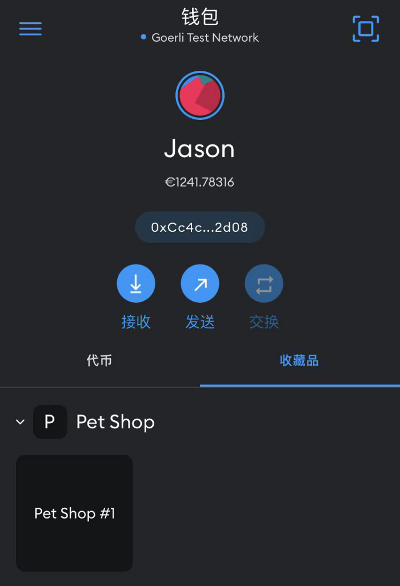

# The PetShop project: Second day on Ethereum

On the second day, we are going to create a simple ERC721 NFT using [OpenZeppelin](https://www.openzeppelin.com/).

## Install OpenZeppelin

We need to install the [upgradeable variant of the OpenZeppelin Contracts library](https://docs.openzeppelin.com/contracts/4.x/upgradeable), which allows us to create ERC721 compliant NTF in Solidity with ease.

We also need the [OpenZeppelin Upgrades plugin for Hardhat](https://docs.openzeppelin.com/upgrades-plugins/1.x/), which allows us to deploy and upgrade proxies for our contracts in JavaScript.

```console
$ npm install --save-dev \
    @openzeppelin/contracts-upgradeable \
    @openzeppelin/hardhat-upgrades
```

We then add the following line near the top of our `hardhat.config.js` file:

```js
require('@openzeppelin/hardhat-upgrades');
```

So that in our custom Hardhat tasks, we will have the `upgrades` instance available in global scope (just like `ethers`).

## Create a PetShop contract

```solidity
// SPDX-License-Identifier: UNLICENSED
pragma solidity ^0.8.13;

import "@openzeppelin/contracts-upgradeable/token/ERC721/extensions/ERC721URIStorageUpgradeable.sol";
import "@openzeppelin/contracts-upgradeable/utils/CountersUpgradeable.sol";

contract PetShop is ERC721URIStorageUpgradeable {
    using CountersUpgradeable for CountersUpgradeable.Counter;
    CountersUpgradeable.Counter private tokenIds;

    function initialize() initializer public {
        __ERC721_init("Pet Shop", "PET");
     }

    function mintToken(string calldata _tokenURI, address _to) external returns (uint256) {
        tokenIds.increment();
        uint256 newTokenId = tokenIds.current();
        _mint(_to, newTokenId);
        _setTokenURI(newTokenId, _tokenURI);
        return newTokenId;
    }
}
```

## Test the PetShop contract

Now create `test/PetShop.js` and add some tests for our PetShop NFT which conforms to the [ERC721 standard](https://eips.ethereum.org/EIPS/eip-721). In addition to the `mintToken()` method we add, we will also test some ERC721 methods like `tokenURI()`, `ownerOf()` and `balanceOf()`.

```js
const { ethers, upgrades } = require("hardhat");
const { expect } = require("chai");
const { loadFixture } = require("@nomicfoundation/hardhat-network-helpers");

// NOTE: We could also use "@openzeppelin/test-helpers".
// See: https://docs.openzeppelin.com/test-helpers/0.5/
const ZERO_ADDRESS = '0x0000000000000000000000000000000000000000';

describe("PetShop contract", function () {

  async function deployPetShopFixture() {
    const PetShop = await ethers.getContractFactory("PetShop");
    // NOTE: This is an upgradeable contract which involves a proxy contract
    // and one or more logic contracts, so the way how it's deployed is a bit different.
    const petShop = await upgrades.deployProxy(PetShop);
    await petShop.deployed();
    const accounts = await ethers.getSigners();
    return { PetShop, petShop, accounts };
  }

  describe("Deployment", function() {
    it("should initialize the NFT name and symbol", async function() {
      const { petShop } = await loadFixture(deployPetShopFixture);
      expect(await petShop.name()).to.equal("Pet Shop");
      expect(await petShop.symbol()).to.equal("PET");
    });
  });

  describe("Transactions", function() {
    it("should mint NFTs", async function() {
      const { petShop, accounts } = await loadFixture(deployPetShopFixture);

      const someAccounts = accounts.slice(1, 4);
      for (let i = 0; i < someAccounts.length; i++) {
        const account = someAccounts[i];
        const tokenID = i + 1; // Token ID should start from 1.
        const tokenURI = `https://petshop.example/nft/${tokenID}`;
        await expect(
          petShop.connect(account).mintToken(tokenURI, account.address)
        ).to.emit(petShop, "Transfer").withArgs(ZERO_ADDRESS, account.address, tokenID);
        expect(await petShop.tokenURI(tokenID)).to.equal(tokenURI);
        expect(await petShop.ownerOf(tokenID)).to.equal(account.address);
        expect(await petShop.balanceOf(account.address)).to.equal(1);
      }

      expect(await petShop.balanceOf(accounts[0].address)).to.equal(0);
    });
  });

});
```

To run the test:

```console
$ npx hardhat test test/PetShop.js
  PetShop contract
    Deployment
      ✔ should initialize the NFT name and symbol (1824ms)
    Transactions
      ✔ should mint NFTs (289ms)
2 passing (2s)
```

## Create a simple Hardhat task

Hardhat allows users to create custom tasks. Tasks in Hardhat are asynchronous JavaScript functions that get access to the Hardhat Runtime Environment, which exposes its configuration and parameters, as well as programmatic access to other tasks and any plugin objects that may have been injected.

Note that the Hardhat Runtime Environment will be available in the global scope. By using Hardhat's ether.js plugin (which is included in the Hardhat Toolbox) and the OpenZeppelin Upgrades plugin, we get access to the `ethers` and `upgrades` instances directly.

Let's create `tasks/petshop.js` and add a simple task `balance` to show balance of an account:

```js
const { task } = require("hardhat/config");

task("balance", "Prints account's balance")
  .addOptionalParam("account", "The account's address")
  .setAction(async (taskArgs) => {
    let accounts = null;
    if (taskArgs.account) {
      accounts = [taskArgs.account];
    } else {
      console.log("Argument --account not provided: Showing all balances.");
      accounts = await ethers.getSigners();
    }
    for (const account of accounts) {
      const balance = await account.getBalance();
      const eth = ethers.utils.formatEther(balance);
      console.log(`${account.address} : ${eth} ETH`);
    }
  });
```

To include our custom task in Hardhat, just import our tasks file in `hardhat.config.js`:

```js
require("./tasks/petshop");
```

Try to invoke the `balance` task:

```console
$ npx hardhat balance
Argument --account not provided: Showing all balances.
0xf39Fd6e51aad88F6F4ce6aB8827279cffFb92266 : 10000.0 ETH
0x70997970C51812dc3A010C7d01b50e0d17dc79C8 : 10000.0 ETH
...
```

## Add a task to deploy the PetShop NFT

Following the same principle, we will add more tasks.

Add a new task in the same `tasks/petshop.js` file to deploy our PetShop NFT contract:

```js
const { task } = require("hardhat/config");

// ... the `balance` task ...

const CONTRACT_NAME = "PetShop";

task("petshop-deploy", `Deploys the ${CONTRACT_NAME} NFT contract`)
  .setAction(async () => {
    const [deployer] = await ethers.getSigners();
    console.log(`Deployer: ${deployer.address} (balance: ${await deployer.getBalance()})`);

    const Contract = await ethers.getContractFactory(CONTRACT_NAME);
    const contract = await upgrades.deployProxy(Contract);
    await contract.deployed();
    console.log(`Deployed ${CONTRACT_NAME} at: ${contract.address}`);

    const name = await contract.name();
    const symbol = await contract.symbol();
    console.log(`Querying NFT: name = ${name}; symbol = ${symbol}`);
  });
```

Open a new terminal and start the Hardhat Network daemon node:

```console
$ npx hardhat node
Started HTTP and WebSocket JSON-RPC server at http://127.0.0.1:8545/
...
```

Open another terminal. Compile and deploy our PetShop contract:

```console
$ npx hardhat compile
Compiled 15 Solidity files successfully

$ npx hardhat petshop-deploy --network localhost
Deployer: 0xf39Fd6e51aad88F6F4ce6aB8827279cffFb92266 (balance: 9999996480306960525680)
Deployed PetShop at: 0x5FC8d32690cc91D4c39d9d3abcBD16989F875707
Querying NFT: name = Pet Shop; symbol = PET
```

After successful deployment, we get the contract address (`0x5FC8d32690cc91D4c39d9d3abcBD16989F875707`). We will need this address in our other tasks.

## Add a task to mint a PetShop NFT

Before adding more tasks, I'll create a `tasks/utils.js` file and add some utility functions in it:

```js
async function loadNFTContract(name, address) {
  const contract = await ethers.getContractAt(name, address);
  // We assume that the contract is ERC721 compliant.
  const nftName = await contract.name();
  const nftSymbol = await contract.symbol();
  console.log(`Loaded NFT contract ${name} from ${address}: ${nftName} (${nftSymbol})`);
  return contract;
}

async function executeTx(asyncTxFunc) {
  console.log('  * Sending tx...');
  const tx = await asyncTxFunc();
  console.log('  * Waiting tx to be mined...');
  const receipt = await tx.wait();
  console.log(`  * Tx executed, gas used: ${receipt.gasUsed}`);
  return receipt;
}

module.exports = {
  loadNFTContract,
  executeTx,
}
```

Note how we load the contract just by name and address: We use the `getContractAt()` helper method added to the `ethers` object by the [hardhat-ethers plugin](https://hardhat.org/hardhat-runner/plugins/nomiclabs-hardhat-ethers#helpers).

Back to `tasks/petshop.js`. To mint a PetShop NFT and award it to an account:

```js
const { task } = require("hardhat/config");
const { loadNFTContract, executeTx } = require("./utils");

const CONTRACT_NAME = "PetShop";

// ... the `balance` task ...

// ... the `petshop-deploy` task ...

task("petshop-mint", `Mints a ${CONTRACT_NAME} NFT to an account`)
  .addParam("address", "The contract address")
  .addParam("to", "The receiving account's address")
  .addParam("uri", "The token's URI")
  .setAction(async (taskArgs) => {
    const contract = await ethers.getContractAt(CONTRACT_NAME, taskArgs.address);
    const name = await contract.name();
    const symbol = await contract.symbol();
    console.log(`Loaded contract from ${taskArgs.address}: ${name} (${symbol})`);

    const accounts = await ethers.getSigners();
    const account = accounts.find(elem => elem.address === taskArgs.to);
    if (account === undefined) {
      throw new Error(`Could not find account with address: ${taskArgs.to}`);
    }

    const receipt = await executeTx(
      async () => contract.connect(account).mintToken(taskArgs.uri, account.address)
    );

    console.log("Looking for Transfer event from receipt...");
    const event = receipt.events.find(event => event.event === 'Transfer');
    const [from, to, tokenID] = event.args;
    console.log(`  event   = ${event.event}`);
    console.log(`  from    = ${from}`);
    console.log(`  to      = ${to}`);
    console.log(`  tokenID = ${tokenID}`);
  });
```

Mint a token and give it to one of our test accounts:

```console
$ npx hardhat petshop-mint --network localhost \
    --address 0x5FC8d32690cc91D4c39d9d3abcBD16989F875707 \
    --to      0x70997970C51812dc3A010C7d01b50e0d17dc79C8 \
    --uri     https://petshop.example/nft/foo/
Loaded contract from 0x5FC8d32690cc91D4c39d9d3abcBD16989F875707: Pet Shop (PET)
  * Sending tx...
  * Waiting tx to be mined...
  * Tx executed, gas used: 111140
Looking for Transfer event from receipt...
  event   = Transfer
  from    = 0x0000000000000000000000000000000000000000
  to      = 0x70997970C51812dc3A010C7d01b50e0d17dc79C8
  tokenID = 1
```

The token we have just minted has a token ID of `1`.

## Add a task to check a PetShop NFT

Given a token ID, to check the NFT:

```js
task("petshop-check", `Checks a ${CONTRACT_NAME} NFT`)
  .addParam("address", "The contract address")
  .addParam("tokenid", "The token ID")
  .setAction(async (taskArgs) => {
    const contract = await loadNFTContract(CONTRACT_NAME, taskArgs.address);
    console.log(`Verifying token URI and owner of token #${taskArgs.tokenid}...`);
    const tokenURI = await contract.tokenURI(taskArgs.tokenid);
    const owner = await contract.ownerOf(taskArgs.tokenid);
    console.log(`  tokenURI = ${tokenURI}`);
    console.log(`  owner    = ${owner}`);
  });
```

Now let's run this task to check the NFT we have just minted:

```console
$ npx hardhat petshop-check --network localhost \
    --address 0x5FC8d32690cc91D4c39d9d3abcBD16989F875707 \
    --tokenid 1
Loaded NFT contract PetShop from 0x5FC8d32690cc91D4c39d9d3abcBD16989F875707: Pet Shop (PET)
Verifying token URI and owner of token #1...
  tokenURI = https://petshop.example/nft/foo/
  owner    = 0x70997970C51812dc3A010C7d01b50e0d17dc79C8
```

## Run on the Goerli testnet

Now we have everything ready. Let's run on the Goerli testnet.

Deploy the contract:

```console
$ npx hardhat petshop-deploy --network goerli
Deployer: 0xCc4c8184CC4A5A03babC13D832cEE3E41bE92d08 (balance: 735988912252889953)
Deployed PetShop at: 0xff27228e6871eaB08CD0a14C8098191279040c13
Querying NFT: name = Pet Shop; symbol = PET
```

Mint a token to my account *Jason*:

```console
$ npx hardhat petshop-mint --network goerli \
    --address 0xff27228e6871eaB08CD0a14C8098191279040c13 \
    --to      0xCc4c8184CC4A5A03babC13D832cEE3E41bE92d08 \
    --uri     https://petshop.example/nft/foo
Loaded contract from 0xff27228e6871eaB08CD0a14C8098191279040c13: Pet Shop (PET)
  * Sending tx...
  * Waiting tx to be mined...
  * Tx executed, gas used: 123193
Looking for Transfer event from receipt...
  event   = Transfer
  from    = 0x0000000000000000000000000000000000000000
  to      = 0xCc4c8184CC4A5A03babC13D832cEE3E41bE92d08
  tokenID = 1
```

Now let's import this NFT into MetaMask. To do so we need the contract address (`0xff27228e6871eaB08CD0a14C8098191279040c13`) and the token ID (`1`).

Once imported, we can view it in MetaMask!



## Conclusion

That's my second day on Ethereum. Full source code can be found here: https://github.com/zhengzhong/petshop/releases/tag/day02

## References

- [Creating your first NFT smart contract from OpenSea](https://docs.opensea.io/docs/creating-an-nft-contract)
