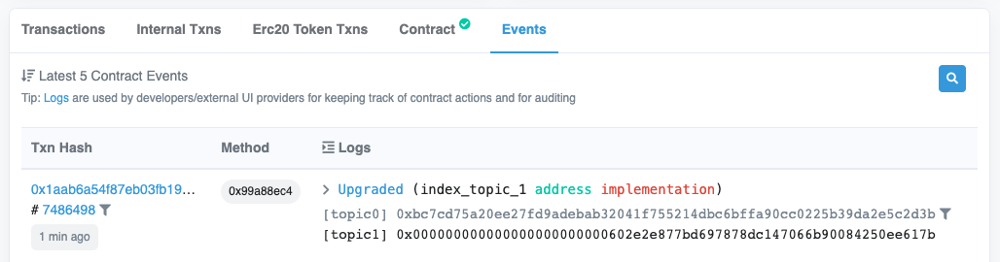

# The PetShop project: Third day on Ethereum

On the third day, I'm going to upgrade my PetShop NFT to version 2.

## Create PetShop version 2

In PetShop version 2, I'm going to introduce 2 minor changes:

- In `mintToken()` method, I'll call `_safeMint()` instead of `_mint()`. The `_safeMint()` method performs some extra checks before minting an NFT: The token ID must not exist, and if the receiving address is a smart contract, it must implement the IERC721Receiver interface.
- I'll add a new external method `version()` which returns the current version number of the contract.

Here's our `PetShop_v2.sol`:

```solidity
// SPDX-License-Identifier: UNLICENSED
pragma solidity ^0.8.16;

import "@openzeppelin/contracts-upgradeable/token/ERC721/extensions/ERC721URIStorageUpgradeable.sol";
import "@openzeppelin/contracts-upgradeable/utils/CountersUpgradeable.sol";

contract PetShop_v2 is ERC721URIStorageUpgradeable {
    using CountersUpgradeable for CountersUpgradeable.Counter;
    CountersUpgradeable.Counter private tokenIds;

    function initialize() initializer public {
        __ERC721_init("Pet Shop", "PET");
     }

    function mintToken(string calldata _tokenURI, address _to) external returns (uint256) {
        tokenIds.increment();
        uint256 newTokenId = tokenIds.current();
        _safeMint(_to, newTokenId);
        _setTokenURI(newTokenId, _tokenURI);
        return newTokenId;
    }

    function version() external pure returns (uint256) {
        return 2;
    }
}
```

We will need to update `deployPetShopFixture()` to prepare PetShop version 2. The old test cases should still pass. In addition, I'll add an extra test case for the `version()` method:

```js
describe("PetShop contract", function () {

  async function deployPetShopFixture() {
    const PetShop_v1 = await ethers.getContractFactory("PetShop");
    const petShop_v1 = await upgrades.deployProxy(PetShop_v1);
    await petShop_v1.deployed();

    const PetShop_v2 = await ethers.getContractFactory("PetShop_v2");
    const petShop_v2 = await upgrades.upgradeProxy(petShop_v1.address, PetShop_v2);
    await petShop_v2.deployed();

    console.assert(petShop_v1.address === petShop_v2.address, "Proxy contract address should not change.");

    // NOTE: Although the proxy contract address should not change, the two versions
    // of the contract have different ABI. We should return the latest version so that
    // we have access to the latest ABI.
    const accounts = await ethers.getSigners();
    return {
      PetShop: PetShop_v2,
      petShop: petShop_v2,
      accounts: accounts,
    };
  }

  describe("Deployment", function() {
    it("should initialize the NFT name and symbol", async function() {
      const { petShop } = await loadFixture(deployPetShopFixture);
      expect(await petShop.name()).to.equal("Pet Shop");
      expect(await petShop.symbol()).to.equal("PET");
    });

    it("should upgrade proxy to version 2", async function() {
      const { petShop } = await loadFixture(deployPetShopFixture);
      expect(await petShop.version()).to.equal(2);
    });
  });

  // ...

});
```

Now run the test:

```console
$ npx hardhat test
  PetShop contract
    Deployment
      ✔ should initialize the NFT name and symbol (2425ms)
      ✔ should upgrade proxy to version 2
    Transactions
      ✔ should mint NFTs (206ms)
```

## Create a task to upgrade the PetShop NFT

Now create a task to upgrade the PetShop NFT:

```js
const CONTRACT_NAME = "PetShop";

// ...

task("petshop-upgrade", `Upgrades the ${CONTRACT_NAME} NFT contract`)
  .addParam("address", "The contract address")
  .addParam("targetVersion", "The target version to upgrade to")
  .setAction(async (taskArgs) => {
    const [deployer] = await ethers.getSigners();
    console.log(`Deployer: ${deployer.address} (balance: ${await deployer.getBalance()})`);

    // See: https://docs.openzeppelin.com/upgrades-plugins/1.x/hardhat-upgrades
    // We follow the convention that our contract name has a version suffix `_vN`.
    const contractName = `${CONTRACT_NAME}_v${taskArgs.targetVersion}`;
    console.log(`Upgrading proxy contract (${taskArgs.address}) to: ${contractName}`);
    const Contract = await ethers.getContractFactory(contractName);
    const contract = await upgrades.upgradeProxy(taskArgs.address, Contract);
    await contract.deployed();
    console.assert(contract.address === taskArgs.address, "Proxy contract address should not change.");

    const name = await contract.name();
    const symbol = await contract.symbol();
    const version = await contract.version();
    console.log(`Upgraded contract ${name} (symbol: ${symbol}) to version ${version}.`);
  });
```

Start the local Hardhat network daemon. Then in another terminal, try to deploy the contract version 1, and then upgrade it to version 2:

```console
$ npx hardhat petshop-deploy --network localhost
Deployer: 0xf39Fd6e51aad88F6F4ce6aB8827279cffFb92266 (balance: 10000000000000000000000)
Deployed PetShop at: 0x9fE46736679d2D9a65F0992F2272dE9f3c7fa6e0
Querying NFT: name = Pet Shop; symbol = PET

$ npx hardhat petshop-upgrade --network localhost \
    --address 0x9fE46736679d2D9a65F0992F2272dE9f3c7fa6e0 \
    --target-version 2
Deployer: 0xf39Fd6e51aad88F6F4ce6aB8827279cffFb92266 (balance: 9999996884701105402650)
Upgrading proxy contract (0x9fE46736679d2D9a65F0992F2272dE9f3c7fa6e0) to: PetShop_v2
Upgraded contract Pet Shop (symbol: PET) to version 2.
```

## Upgrade the PetShop NFT on Goerli testnet

Previously I already have the PetShop NFT deployed on Goerli testnet. Its address is `0xff27228e6871eaB08CD0a14C8098191279040c13`, [viewable on Etherscan](https://goerli.etherscan.io/address/0xff27228e6871eaB08CD0a14C8098191279040c13). Now let's run the `petshop-upgrade` task to upgrade it:

```console
$ npx hardhat petshop-upgrade --network goerli \
    --address 0xff27228e6871eaB08CD0a14C8098191279040c13 \
    --target-version 2
Deployer: 0xCc4c8184CC4A5A03babC13D832cEE3E41bE92d08 (balance: 735936919700656242)
Upgrading proxy contract (0xff27228e6871eaB08CD0a14C8098191279040c13) to: PetShop_v2
Upgraded contract Pet Shop (symbol: PET) to version 2.
```

After the upgrade, on Etherscan we can see an `Upgraded` event was emitted:



Note that the *proxy* contract address does not change during the upgrade. We will just create a new *logic* contract and update the proxy contract to point to it. Because the proxy contract is the one users or wallets interact with, such kind of upgrade is transparent to the token holders.

## Conclusion

This is my third day on Ethereum. The changes to the PetShop NFT are just minor ones. What's more important is to understand how to manage smart contract upgrades using OpenZeppelin's proxy upgrade pattern. Full source code can be found here: https://github.com/zhengzhong/petshop/releases/tag/day03

## References

- [Writing Upgradeable Contracts](https://docs.openzeppelin.com/upgrades-plugins/1.x/writing-upgradeable)
- [Proxy Upgrade Pattern](https://docs.openzeppelin.com/upgrades-plugins/1.x/proxies)
