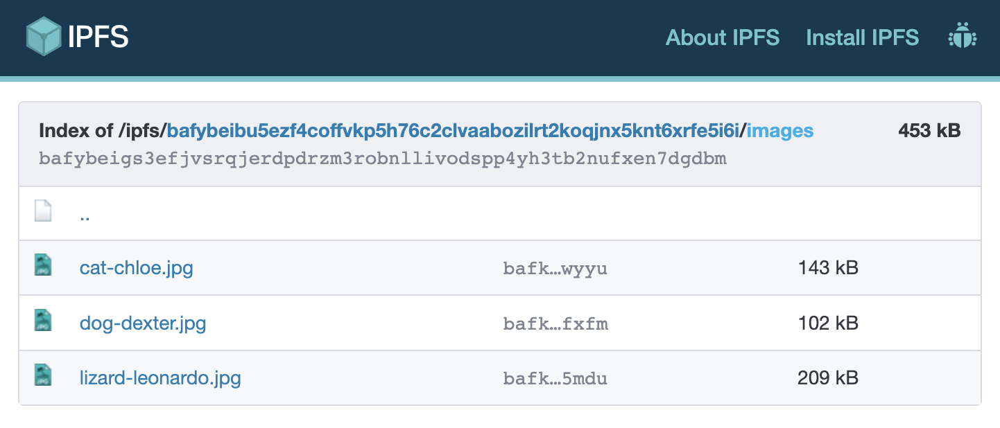
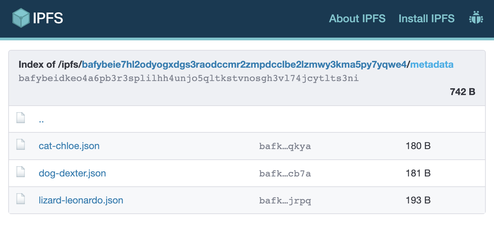
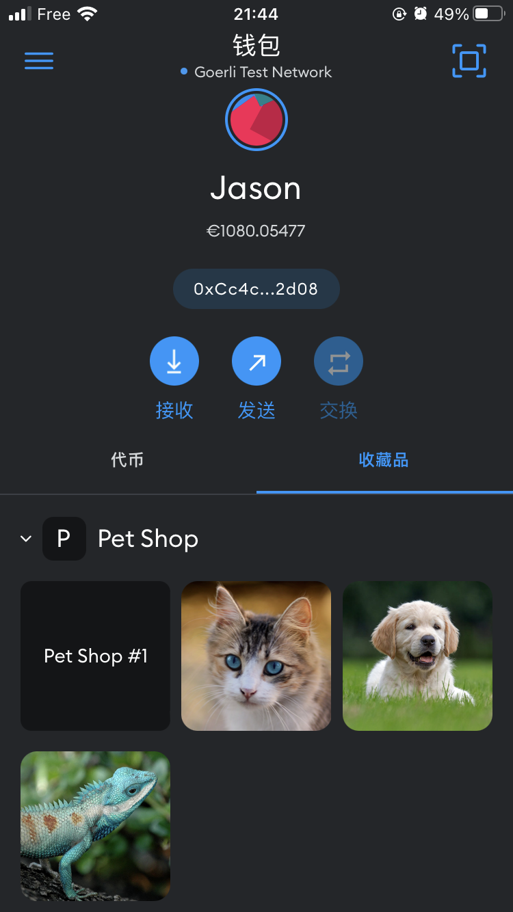

# The PetShop project, day 4: Adding metadata to the PetShop NFT

Our PetShop NFT contract extends OpenZeppelin's `ERC721URIStorageUpgradeable` contract, which is an implementation of [ERC721](https://eips.ethereum.org/EIPS/eip-721) that includes the metadata standard extensions ([`IERC721Metadata`](https://docs.openzeppelin.com/contracts/4.x/api/token/erc721#IERC721Metadata)) as well as a mechanism for per-token metadata. So we could give each token a URI which points to a JSON file that conforms to the "ERC721 Metadata JSON Schema".

On the fourth day, I'm going to upload some images and ERC721 metadata JSON files to IPFS (InterPlanetary File System) via [NTF.Storage](https://nft.storage/), and mint some more tokens with URI. Then I'll be able to view the newly minted tokens with their images in my MetaMask.

## Create and upload images and ERC721 metadata JSON files

Firstly, create an `images` directory and put some pet images in it. Here is my `images` directory:

```console
$ tree images
images
├── cat-chloe.jpg
├── dog-dexter.jpg
└── lizard-leonardo.jpg

0 directories, 3 files
```

Then we will use [ipfs-car](https://www.npmjs.com/package/ipfs-car) to pack our images directory into a CAR ([Content Addressable aRchives](https://ipld.io/specs/transport/car/)) file.

```console
$ npm install --save-dev ipfs-car
...

$ npx ipfs-car --pack images --output images.car
root CID: bafybeibu5ezf4coffvkp5h76c2clvaabozilrt2koqjnx5knt6xrfe5i6i
  output: images.car
```

Go to NFT.storage, login with GitHub account, and then upload `images.car`. This will give us a unique URI to our CAR file, and we can get an individual URL for each of the images included in the CAR.



Then, create a `metadata` directory and add some ERC721 metadata JSON files for our future tokens. Here is my `metadata` directory:

```console
$ tree metadata
metadata
├── cat-chloe.json
├── dog-dexter.json
└── lizard-leonardo.json

0 directories, 3 files
```

And here is `metadata/cat-chloe.json`:

```js
{
  "name" : "Chloé",
  "description" : "Chloé Cat",
  "image": "https://bafybeibu5ezf4coffvkp5h76c2clvaabozilrt2koqjnx5knt6xrfe5i6i.ipfs.nftstorage.link/images/cat-chloe.jpg"
}
```

Notice the `image` property: This is the URL of our cat image from the CAR file we just uploaded.

Follow the same principle to create a CAR file for the metadata, and upload it to NFT.Storage:

```console
$ npx ipfs-car --pack metadata --output metadata.car
root CID: bafybeie7hl2odyogxdgs3raodccmr2zmpdcclbe2lzmwy3kma5py7yqwe4
  output: metadata.car
```



## Mint tokens with metadata

Now I can mint some more tokens with metadata to my account *Jason*:

```console
$ export PETSHOP_ADDRESS=0xff27228e6871eaB08CD0a14C8098191279040c13
$ export JASON_ADDRESS=0xCc4c8184CC4A5A03babC13D832cEE3E41bE92d08
$ export METADATA_BASE_URL=https://bafybeie7hl2odyogxdgs3raodccmr2zmpdcclbe2lzmwy3kma5py7yqwe4.ipfs.nftstorage.link/metadata

$ npx hardhat petshop-mint --network goerli \
    --address $PETSHOP_ADDRESS \
    --to      $JASON_ADDRESS \
    --uri     $METADATA_BASE_URL/cat-chloe.json
Loaded contract from 0xff27228e6871eaB08CD0a14C8098191279040c13: Pet Shop (PET)
  * Sending tx...
  * Waiting tx to be mined...
  * Tx executed, gas used: 179504
Looking for Transfer event from receipt...
  event   = Transfer
  from    = 0x0000000000000000000000000000000000000000
  to      = 0xCc4c8184CC4A5A03babC13D832cEE3E41bE92d08
  tokenID = 2

$ npx hardhat petshop-mint --network goerli \
    --address $PETSHOP_ADDRESS \
    --to      $JASON_ADDRESS \
    --uri     $METADATA_BASE_URL/dog-dexter.json
Loaded contract from 0xff27228e6871eaB08CD0a14C8098191279040c13: Pet Shop (PET)
  * Sending tx...
  * Waiting tx to be mined...
  * Tx executed, gas used: 179516
Looking for Transfer event from receipt...
  event   = Transfer
  from    = 0x0000000000000000000000000000000000000000
  to      = 0xCc4c8184CC4A5A03babC13D832cEE3E41bE92d08
  tokenID = 3

$ npx hardhat petshop-mint --network goerli \
    --address $PETSHOP_ADDRESS \
    --to      $JASON_ADDRESS \
    --uri     $METADATA_BASE_URL/lizard-leonardo.json
Loaded contract from 0xff27228e6871eaB08CD0a14C8098191279040c13: Pet Shop (PET)
  * Sending tx...
  * Waiting tx to be mined...
  * Tx executed, gas used: 179576
Looking for Transfer event from receipt...
  event   = Transfer
  from    = 0x0000000000000000000000000000000000000000
  to      = 0xCc4c8184CC4A5A03babC13D832cEE3E41bE92d08
  tokenID = 4
```

Once minted, I can add them in my MetaMask wallet:



## Conclusion

On the fourth day, I experimented with NFT metadata and IPFS / NFT.Storage. There is no code changes.

## References

- [Adding metadata and payments to your contract (from OpenSea)](https://docs.opensea.io/docs/part-3-adding-metadata-and-payments-to-your-contract)
